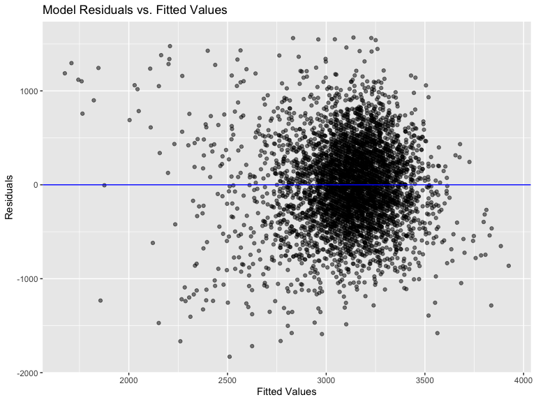
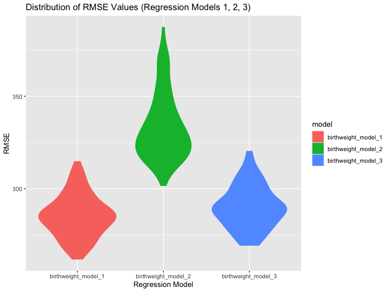
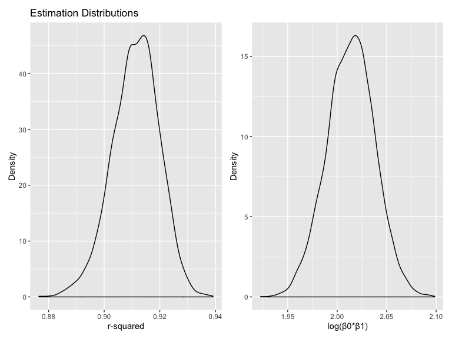

P8105\_ Homework 6
================

## Problem 1

Read in and clean birthweight data\_ Clean variable names, drop missing
data, recode variables to factor variables (i.e. babysex, race, etc.)

### Propose a regression model for birthweight.

The ouctome is birthweight (bwt).  
The tentative predictors are:

Mother’s Factors:  
\- mrace: mother’s race  
\- menarche: mother’s age at menarche  
\- mheight: mother’s height  
\- momage: mother’s age at delivery  
\- ppbmi: mother’s pre-pregnancy BMI  
\- ppwt: mother’s pre-pregnancy weight

Gestation Factors:  
\- gaweeks: gestational age in weeks  
\- delwt: mother’s weight at delivery (pounds)  
\- smoken: average number of cigarettes smoked per day during
pregnancy  
\- wtgain: mother’s weight gain during pregnancy

Mother’s Prior History Risk Factors:  
\- parity: number of prior live births  
\- pnumlbw: number of previous low birth weight babies  
\- pnumsga: number of previous births with small for gestational age
babies

Other Family Factors:  
\- fincome: family monthly income  
\- frace: father’s race

Baby Factors:  
\- malform: presence of malformations that relate to weight

Birthweight has been reported in the literature to relate to gestational
age, history of previous low birth weight babies, mother’s smoking
status, income, and malformations related to weight.  
\#\#Model
1

``` r
birthweight_model_1 = lm(bwt ~ gaweeks + smoken + pnumlbw + fincome + malform, data = birthweight_data)
birthweight_model_1 %>% 
  broom::tidy() %>% 
  select(term, estimate, p.value) %>% 
  knitr::kable(digits = 3, caption = "Regression Summary (Model 1)")
```

| term           | estimate | p.value |
| :------------- | -------: | ------: |
| (Intercept)    |  458.699 |   0.000 |
| gaweeks        |   65.445 |   0.000 |
| smoken         |  \-6.899 |   0.000 |
| fincome        |    2.354 |   0.000 |
| malformpresent |   65.615 |   0.582 |
| \#\# Residuals |          |         |

Regression Summary (Model 1)

``` r
birthweight_data %>% 
  modelr::add_residuals(birthweight_model_1) %>%
  modelr::add_predictions(birthweight_model_1) %>% 
  ggplot(aes(x = pred, y = resid)) + 
    geom_point(alpha = 0.5) + 
    geom_hline(yintercept = 0, color = "blue") + 
    labs(
      title = "Model Residuals vs. Fitted Values",
      x = "Fitted Values",
      y = "Residuals")
```



\#\#Compare your model to two others:  
\#Model 2: Using length at birth and gestational age as predictors (main
effects
only)

``` r
birthweight_model_2 = lm(bwt ~ gaweeks + blength, data = birthweight_data)
birthweight_model_2 %>% 
  broom::glance()  %>%
  knitr::kable(caption = "Regression Summary (Model 2)")
```

| r.squared | adj.r.squared |    sigma | statistic | p.value | df |     logLik |      AIC |      BIC |  deviance | df.residual |
| --------: | ------------: | -------: | --------: | ------: | -: | ---------: | -------: | -------: | --------: | ----------: |
| 0.5768894 |     0.5766943 | 333.2174 |  2958.001 |       0 |  3 | \-31381.32 | 62770.64 | 62796.14 | 481775844 |        4339 |

Regression Summary (Model 2)

\#Model 3: Using head circumference, length, sex, and all interactions
(including the three-way interaction) between
these

``` r
birthweight_model_3 = lm(bwt ~ bhead + blength + babysex + bhead * blength + bhead * babysex + blength * babysex + bhead * blength * babysex, data = birthweight_data)
birthweight_model_3 %>% 
  broom::glance()  %>%
  knitr::kable(caption = "Regression Summary (Model 3)")
```

| r.squared | adj.r.squared |    sigma | statistic | p.value | df |    logLik |      AIC |      BIC |  deviance | df.residual |
| --------: | ------------: | -------: | --------: | ------: | -: | --------: | -------: | -------: | --------: | ----------: |
|  0.684876 |      0.684367 | 287.7344 |  1345.616 |       0 |  8 | \-30741.6 | 61501.19 | 61558.58 | 358816655 |        4334 |

Regression Summary (Model 3)

Make the comparison in terms of the cross-validated prediction error;
use crossv\_mc and functions in purrr as appropriate.

``` r
cv_birthweight_models =
  crossv_mc(birthweight_data, 100) %>%
    mutate(train = map(train, as_tibble),
      test = map(test, as_tibble))
```

``` r
cv_birthweight_models = cv_birthweight_models %>%
  mutate(birthweight_model_1  = map(train, ~lm(bwt ~ gaweeks + bhead + blength + smoken + fincome + pnumlbw, data = .x)),
      birthweight_model_2  = map(train, ~lm(bwt ~ gaweeks + blength, data = .x)),
      birthweight_model_3  = map(train, ~lm(bwt ~ bhead + blength + babysex + bhead * blength + bhead * babysex + blength * babysex + bhead * blength * babysex, data = as_tibble(.x)))) %>% 
    mutate(rmse_birthweight_model_1 = map2_dbl(birthweight_model_1, test, ~rmse(model = .x, data = .y)),
      rmse_birthweight_model_2   = map2_dbl(birthweight_model_2, test, ~rmse(model = .x, data = .y)),
      rmse_birthweight_model_3 = map2_dbl(birthweight_model_3, test, ~rmse(model = .x, data = .y)))
```

``` r
cv_birthweight_models %>% 
  select(starts_with("rmse")) %>% 
  pivot_longer(everything(),
    names_to = "model", 
    values_to = "rmse",
    names_prefix = "rmse_") %>% 
  mutate(model = fct_inorder(model)) %>% 
  ggplot(aes(x = model, y = rmse)) + 
    geom_violin(aes(fill = model, color = model)) +
    labs(title = "Distribution of RMSE Values (Regression Models 1, 2, 3)",
      x = "Regression Model",
      y = "RMSE")
```



Model 1 has the lowest error (in prediction) followed by Model 3 \#\#
Problem 2

Download Central Park Weather Data

``` r
weather_df = 
  rnoaa::meteo_pull_monitors(
    c("USW00094728"),
    var = c("PRCP", "TMIN", "TMAX"), 
    date_min = "2017-01-01",
    date_max = "2017-12-31") %>%
  mutate(
    name = recode(id, USW00094728 = "CentralPark_NY"),
    tmin = tmin / 10,
    tmax = tmax / 10) %>%
  select(name, id, everything())
```

    ## file path:          /Users/katherinedimitropoulou/Library/Caches/rnoaa/ghcnd/USW00094728.dly

    ## file last updated:  2019-11-25 19:25:37

    ## file min/max dates: 1869-01-01 / 2019-11-30

``` r
weather_df
```

    ## # A tibble: 365 x 6
    ##    name           id          date        prcp  tmax  tmin
    ##    <chr>          <chr>       <date>     <dbl> <dbl> <dbl>
    ##  1 CentralPark_NY USW00094728 2017-01-01     0   8.9   4.4
    ##  2 CentralPark_NY USW00094728 2017-01-02    53   5     2.8
    ##  3 CentralPark_NY USW00094728 2017-01-03   147   6.1   3.9
    ##  4 CentralPark_NY USW00094728 2017-01-04     0  11.1   1.1
    ##  5 CentralPark_NY USW00094728 2017-01-05     0   1.1  -2.7
    ##  6 CentralPark_NY USW00094728 2017-01-06    13   0.6  -3.8
    ##  7 CentralPark_NY USW00094728 2017-01-07    81  -3.2  -6.6
    ##  8 CentralPark_NY USW00094728 2017-01-08     0  -3.8  -8.8
    ##  9 CentralPark_NY USW00094728 2017-01-09     0  -4.9  -9.9
    ## 10 CentralPark_NY USW00094728 2017-01-10     0   7.8  -6  
    ## # … with 355 more rows

Focus on a simple linear regression with tmax as the response and tmin
as the predictor:

``` r
lm(tmax ~ tmin, data = weather_df) %>% 
  broom::tidy() %>% 
  knitr::kable(digits = 3)
```

| term        | estimate | std.error | statistic | p.value |
| :---------- | -------: | --------: | --------: | ------: |
| (Intercept) |    7.209 |     0.226 |    31.847 |       0 |
| tmin        |    1.039 |     0.017 |    61.161 |       0 |

We are interested in the distribution of two quantities estimated from
these data: r^2 and log(β<sup>0∗β</sup>1). Use 5000 bootstrap samples
and, for each bootstrap sample, produce estimates of these two
quantities.

``` r
weather_estimates =
weather_df %>% 
  modelr::bootstrap(n = 5000) %>% 
  mutate(
    models = map(strap, ~lm(tmax ~ tmin, data = .x)),
    results = map(models, broom::tidy), 
    glance = map(models, broom::glance)) %>% 
  select(results, glance) %>% 
  unnest(results, glance) %>% 
  janitor::clean_names() %>% 
  select(term, estimate, r_squared) %>% 
  pivot_wider(
    names_from = term, 
    values_from = estimate)  %>% 
  janitor::clean_names() %>% 
  mutate(
    log_betas = log(intercept * tmin)) 
```

Plot the distribution of your estimates.

``` r
rsquared_plot = 
  weather_estimates %>% 
  ggplot(aes(x = r_squared)) +
  geom_density() +
  labs(
    title = "Estimation Distributions",
    x = "r-squared",
    y = "Density")
log_betas_plot = 
  weather_estimates %>% 
  ggplot(aes(x = log_betas)) +
  geom_density() +
   labs(
    x = "log(β0*β1)",
    y = "Density")
(rsquared_plot + log_betas_plot)
```


*These plots demonstrate that the estimates are approximately normally
distributed.*

Using the 5000 bootstrap estimates, identify the 2.5% and 97.5%
quantiles to provide a 95% confidence interval for r^2 and
log(β<sup>0∗β</sup>1).

``` r
pull(weather_estimates, r_squared) %>% 
  quantile(c(0.025, 0.975))
```

    ##      2.5%     97.5% 
    ## 0.8935988 0.9266271

``` r
pull(weather_estimates, log_betas) %>%
  quantile(c(0.025, 0.975))
```

    ##     2.5%    97.5% 
    ## 1.965423 2.059797

*The 95% CI for r-squared is (0.8935, 0.9266). The 95% CI for
log(β<sup>0∗β</sup>1) is (1.9654, 2.059).*
